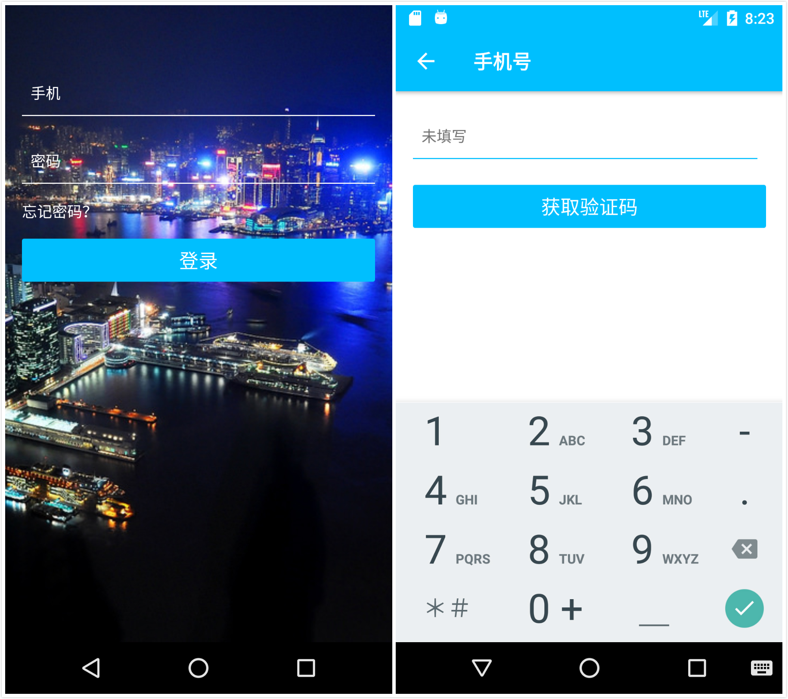
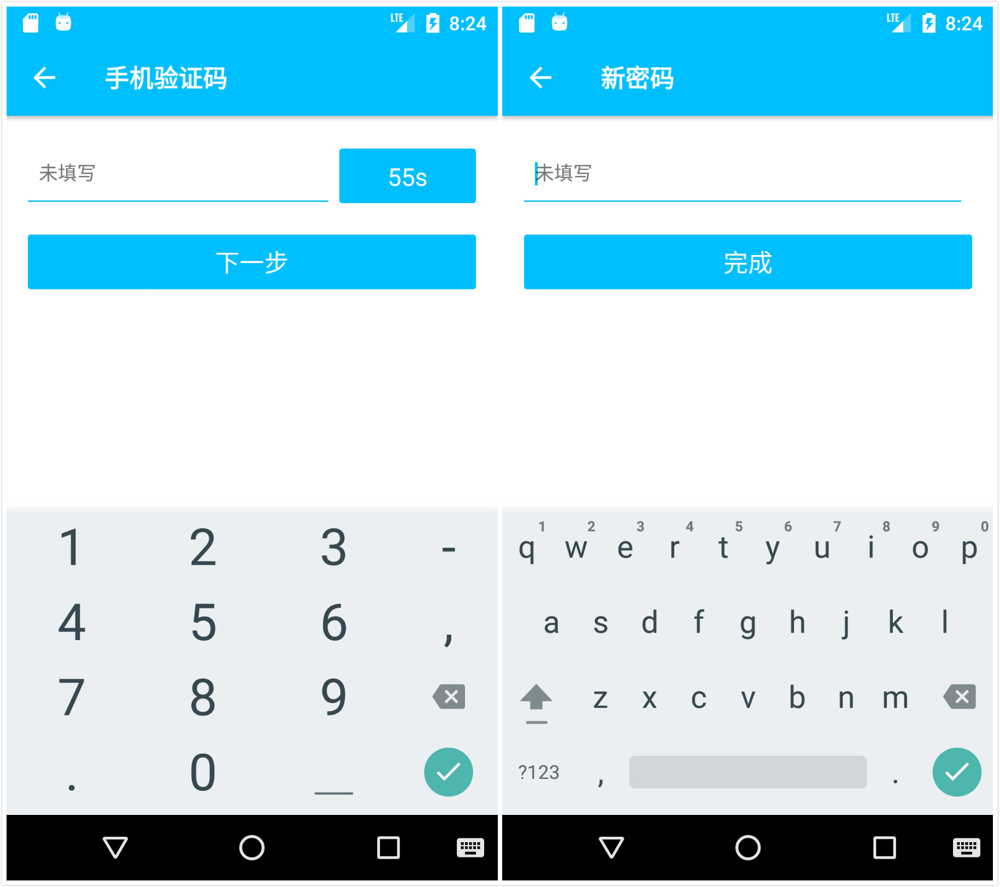
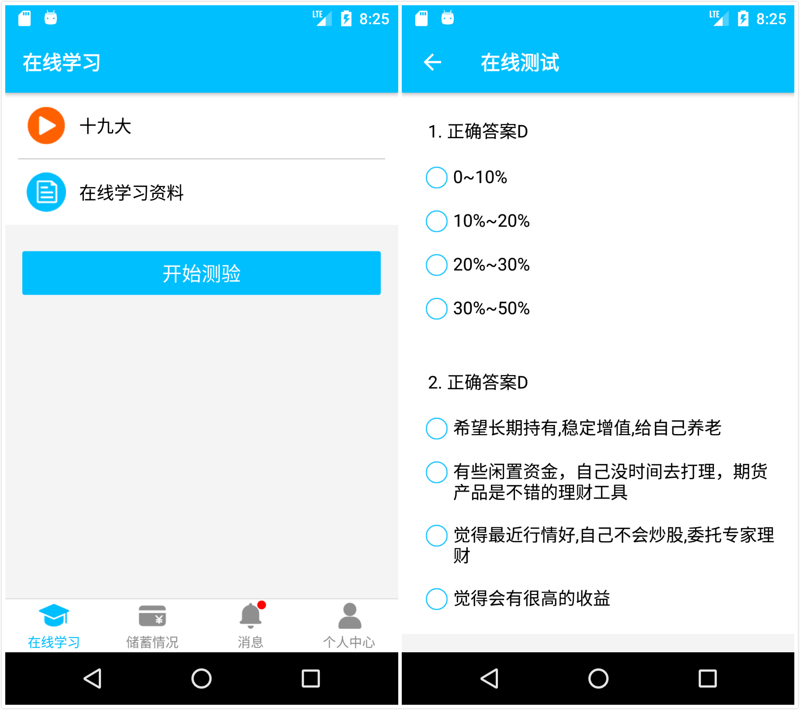
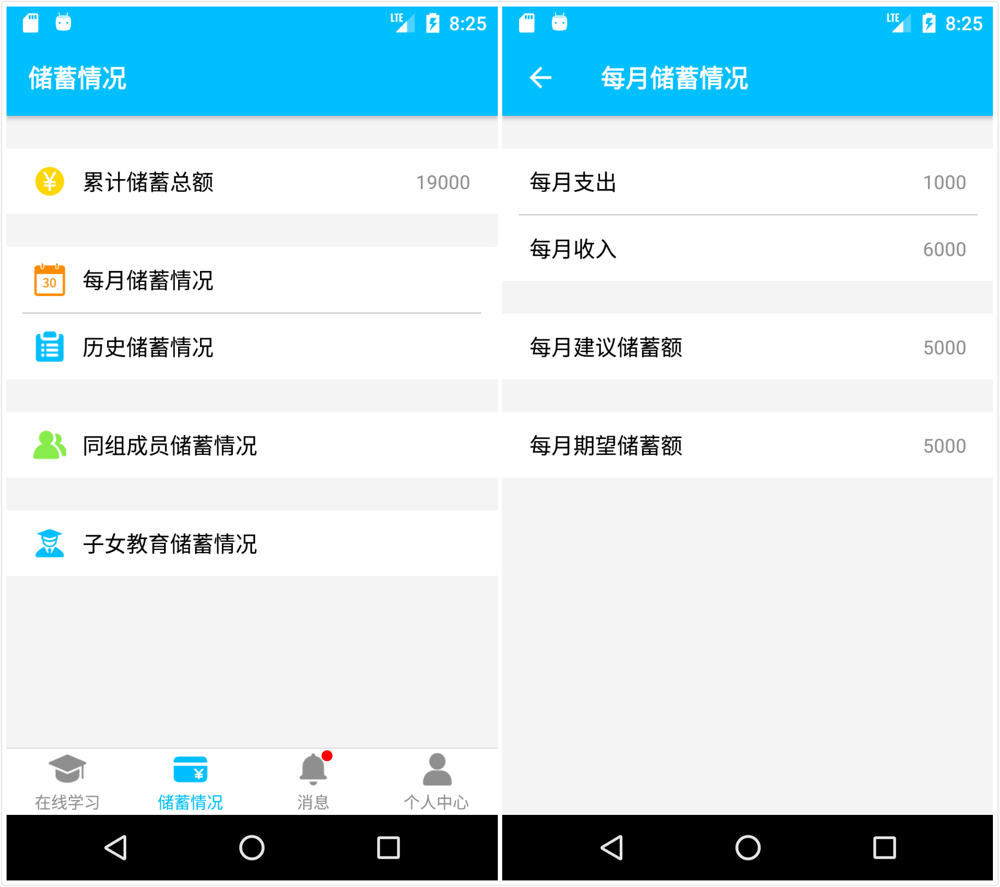
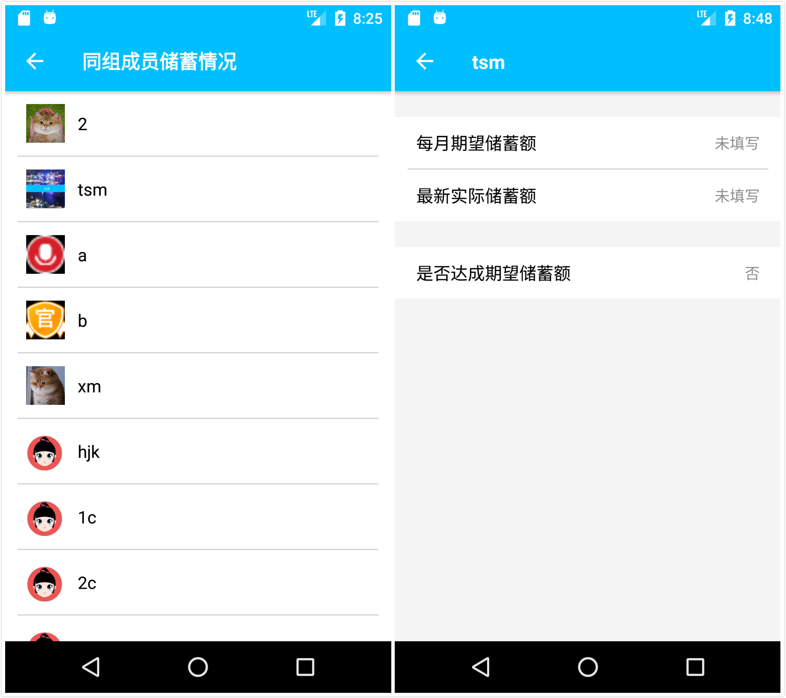
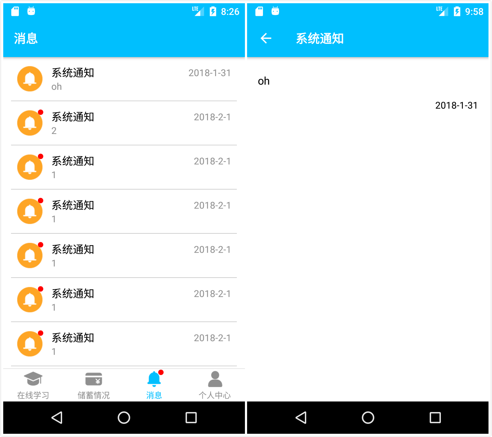
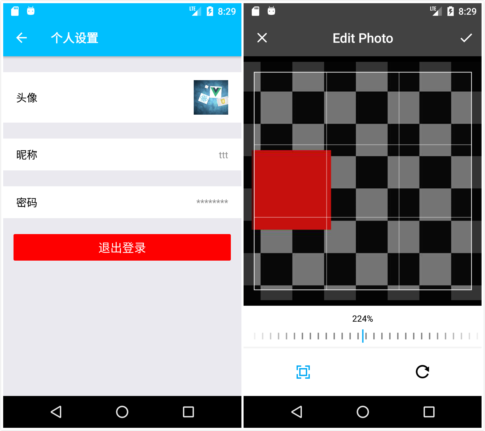

# SavingsTestApplication

## Description

An iOS/Android application for the savings test based on React Native.

## Screenshots










## Getting started

### 1. Clone the repository

```
$ git clone https://github.com/Tissot/SavingsTestApplication.git
$ cd SavingsTestApplication
```

### 2. Install the dependencies

```
$ npm install
```

### 3. Run the Application

- #### iOS

```
$ react-native run-ios
```

- #### Android

```
$ react-native run-android
```

- #### Start server

```
$ react-native start
```

## License
GNU General Public License v3.0
